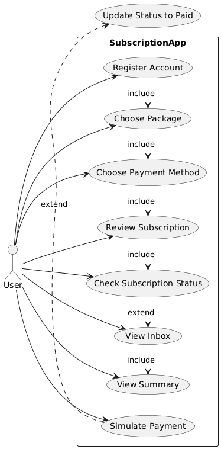
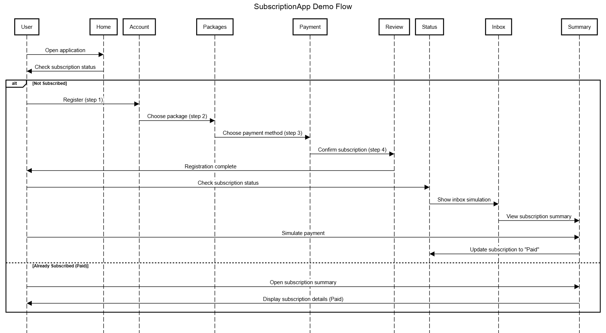
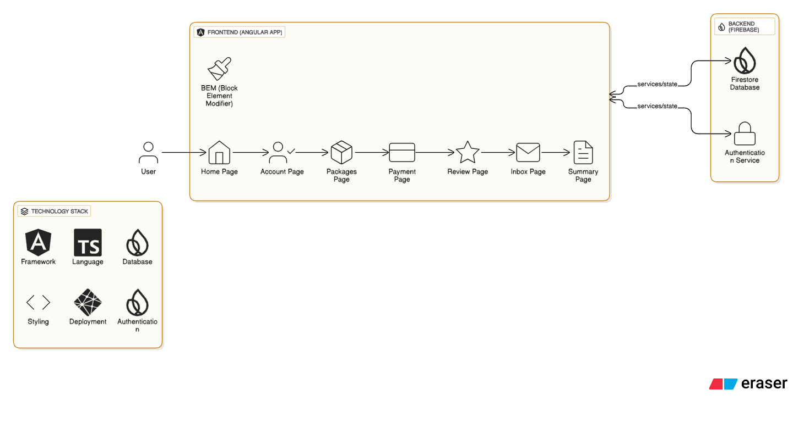
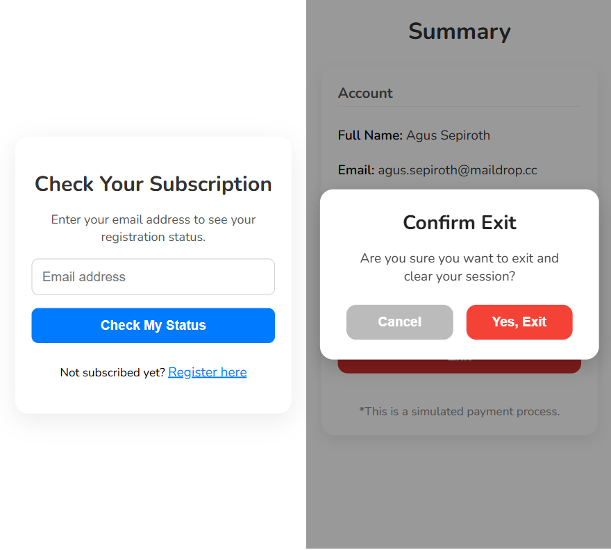
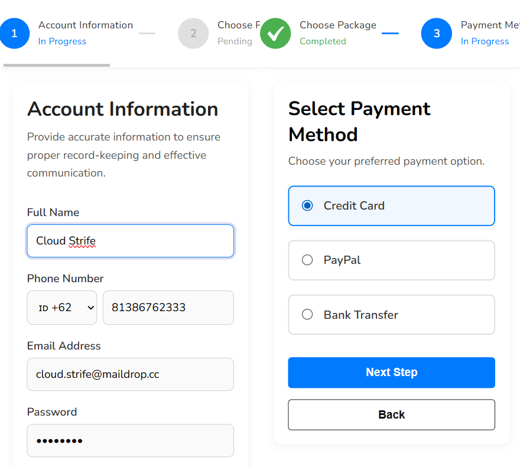

# SubscriptionApp

This project is a **demo portfolio** representing a subscription-based application I previously worked on.  
**Note:** This is not the original source code, but a representation inspired by the actual project. The original application was built using **Angular**, **TypeScript**, and **Firebase Firestore** as the datastore.  
Additionally, the project uses **BEM (Block Element Modifier)** methodology for CSS class naming to keep styles modular and maintainable.

**Demo:** [https://mvpsubscriptionapp.netlify.app/](https://mvpsubscriptionapp.netlify.app/)

---

This project was generated with [Angular CLI](https://github.com/angular/angular-cli) version 17.1.2.

## Demo Flow

1. Start from the home page.  
   If the user has not subscribed yet, the status cannot be checked and registration is required.

2. Follow the registration process through several steps:  
   - Account setup  
   - Package selection  
   - Payment details  
   - Review and confirmation  

3. After completing the registration, the user can:  
   - Check subscription status  
   - View the inbox simulation  
   - Open the subscription summary  

4. From the summary, the user can simulate a payment process.  
   Once the payment is confirmed, the subscription status changes to **paid**.

---

## Diagrams

### Use Case Diagram


### Sequence Diagram


### Architecture Diagram


---

## Screenshots




## Development server

Run `ng serve` for a dev server. Navigate to `http://localhost:4200/`. The application will automatically reload if you change any of the source files.

## Code scaffolding

Run `ng generate component component-name` to generate a new component. You can also use `ng generate directive|pipe|service|class|guard|interface|enum|module`.

## Build

Run `ng build` to build the project. The build artifacts will be stored in the `dist/` directory.

## Running unit tests

Run `ng test` to execute the unit tests via [Karma](https://karma-runner.github.io).

## Running end-to-end tests

Run `ng e2e` to execute the end-to-end tests via a platform of your choice. To use this command, you need to first add a package that implements end-to-end testing capabilities.

## Further help

To get more help on the Angular CLI use `ng help` or go check out the [Angular CLI Overview and Command Reference](https://angular.io/cli) page.


## License

This project is licensed under the **MIT License**.  
You are free to use, modify, and distribute this project for research, educational, or personal portfolio purposes.  
For more details, please refer to the [LICENSE](LICENSE) file.

## Firebase Configuration

This project requires Firebase configuration to connect with the backend services.  
The configuration file is located at:

```
src/app/environments/firebase.ts
```

Example (values have been anonymized):

```ts
export const environment = {
  production: false,
  firebaseConfig: {
    apiKey: "AIzaSy***************",
    authDomain: "subscription-app-****.firebaseapp.com",
    projectId: "subscription-app-****",
    storageBucket: "subscription-app-****.appspot.com",
    messagingSenderId: "************",
    appId: "1:************:web:****************",
    measurementId: "G-**********"
  }
};
```
